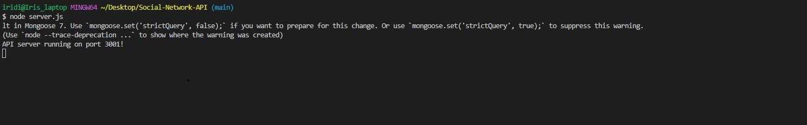
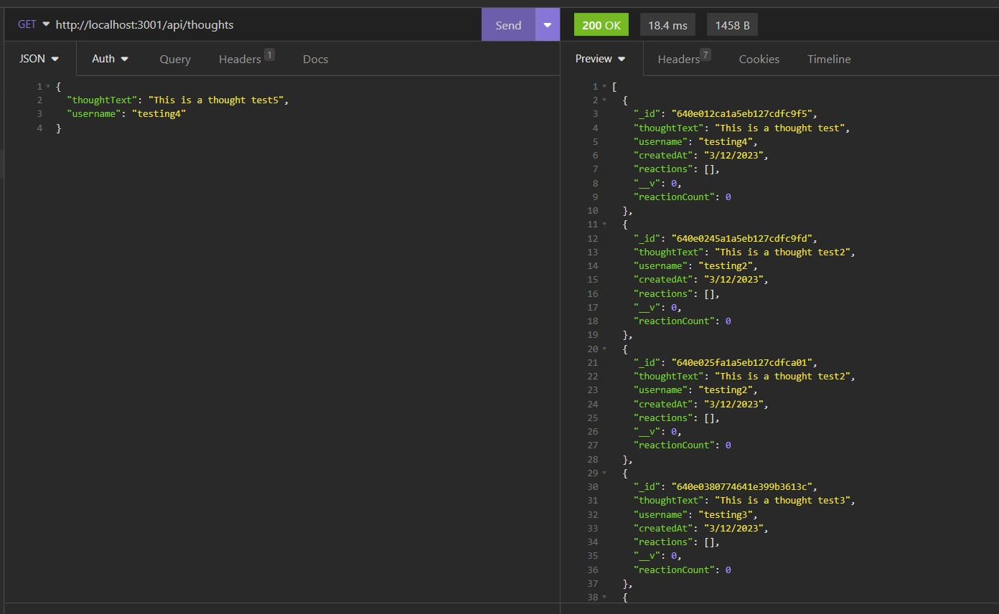
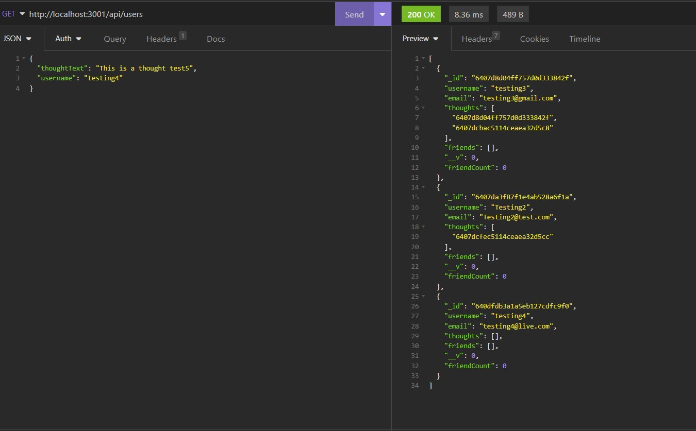

# Social-Network-API 

table of contents
  - [About the project](#abouttheproject)
  - [Installation](#installation)
  - [description](#description)
  - [Usage](#usage)
  - [Credits](#credits)
  - [license](#license)

## About the project ##

This project is to build an API for a social network web application where users can share their thoughts, react to friends’ thoughts, and create a friend using MongoDB since it is a  popular choice for many social networks due to its speed with large amounts of data and flexibility with unstructured data. This app is focused on users who want to use MongoDB and use or create data to manipulate with CRUD in the back end.

## Installation ##

In order to be able to use this app Social-Network-API, the user needs to install `package.json` by using the command `npm init` with the following packages:
  "scripts": {
    "start": "node index",
    "dev": "nodemon index",
    "seed": "node utils/seed"
  },
  "dependencies": {
    "express": "^4.17.1",
    "mongoose": "^6.0.13"
  },
  "devDependencies": {
    "nodemon": "^2.0.9"
  }
   Once the user has the necessary packages to be able to use this app. 
   
## Description

This projects is for everyone who is interested in manipulate data using MongoDB using the back end with express and some end point routes, The user can add an user in insomnia based on the user model requirements : username and email and once it is done it will be able to add thought and reactions or add friends to other users. In the case of CRUD the user can update, delete and creater more thoughts, users, friends and reactions through the end poin routes used in insomnia.

## Usage ##

The main reason of this app is to use CRUD for users to manipulate thoughts, reactions and add/delete friends from their database usign MongoDB and insomnia.
Once the user added the package.json, he is going to use the command line to write `node server.js` and il will connect with the server 3001! and the user can use insomnia with the link `http://localhost:3001/api/` and use CREATE, POST, DELETE, UPDATE data. 

[Video of Social-Network-API](https://app.castify.com/view/9e0497bd-067d-4c7b-b6fb-e808033209f3)

## Credits 

N/A

## License 
N/A 